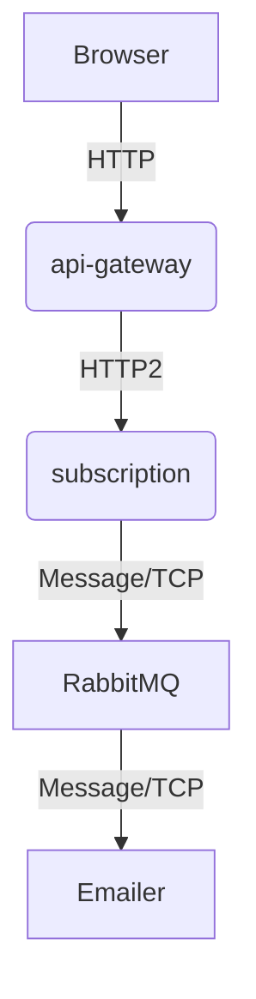

# subscription service backend

Service Backend for subscription with email, and send emails

```mermaid

graph TD

A[Browser] -->|HTTP| B(api-gateway)
B -->|HTTP2| D(subscription)
D -->|Message/TCP| E[RabbitMQ]
E -->|Message/TCP| F[Emailer]
    

```