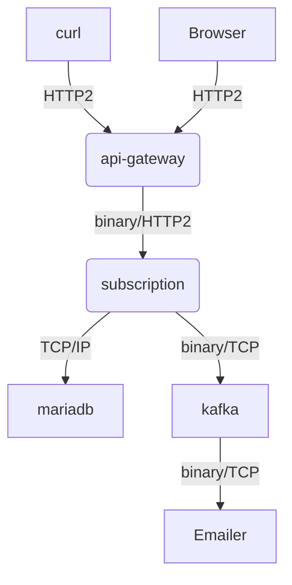

# subscription service backend

Service Backend for subscription with email, and send emails

Basic definition of architecture as diagram:

looking for service that achieve:
- high volume
- low latency
- high resilience
- high availability
- scalable

also that meet this other requiriment:
- solution reusable
- component to scale horizontally
- care about data and security
- operational database economically
- design for failure

the services: 
public service (response 100ms, public network)
- microservice
- request by UI
- test (logic, service)

subcription service (response 150ms, secure) 
- microservice
- secure
- exception handling
- test (logic, service)
- persistence subscription

email service (response 60s, secure)
- microservice
- secure
- exception handling
- test (logic, service)
- email notification


model:
subscription (email, born, newsletter, campaign, +firstName, +gender  )

features over model:
    list, create, read, delete

## desition




- using grpc is advantage if requimement high performance. so it use gcrp to increase performance between apigateway-service and subscription-service converting subscription-service in microservice for scaling

- it use kafka, as the technology chosen kafka for high volume, horizontal scaling, fault-tolerant durable way  and design for failure and delivery guaranty. optional was in consideration RabbitMQ.

[Definitive comparison](https://arxiv.org/pdf/1912.03715.pdf)

- it use mariadb as persistance layer, but could be any other persistence service.


for the backend:
- it use nestjs
- with express.js

TODO: Fastify provides a good alternative framework for Nest because it solves design issues in a similar manner to Express. However, fastify is much faster than Express, achieving almost two times better benchmarks results


## requirements

have installed:

docker, version 20.10.5
docker-compose, version 1.17.1
node, version 15.2.1
npm,  7.0.8


### build

the way of building is this:

```sh
( cd api-gateway && npm run install && npm run build )
( cd subcription && npm run install && npm run build )
( cd emailer     && npm run install && npm run build )
```
 TODO: improvement is to use lerna for building

## start:

after generate dist folder in:
(api-gateway, subcription, emailer)

edit .env file as needed and start the application

```sh
docker-compose up
```


## develop

micro services modules:
- api-gateway
- subscription
- emailer

extra service dependency:
- mariadb
- kafka
- zookeeper

run any project individual:

```sh
( cd api-gateway && npm run start:dev )
( cd subcription && npm run start:dev )
( cd emailer     && npm run start:dev )
```

## test
```sh
( cd api-gateway && npm run test:e2e )
( cd subcription && npm run test:e2e )
( cd emailer     && npm run test:e2e )
```


## some libraries used:

for library (name, do, why)
@nestjs/cli : it generate an service as module
@nestjsx/crud : it genrate crud for easy starting, after it posible you will need to do connection to db manually


## improvement

TODO: fix: (build, deployment) for some reason emailer service is not able to connect to kafka from docker

TODO: feature: (test) they are imcomplete, some basic integration test for api-gateway, but should be improved

TODO: feature: database indexing

TODO: feature: swagger was working but when added grpc then it is need to another way around , maybe open-api 

TODO: security server credential gRPC

## missing 

- handler exception
- authentication (jwt) and authorization
- loggers
- healty check
- kubernates Roadmap
- CI/CD pipelines
- security

